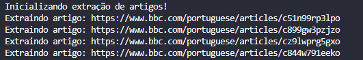
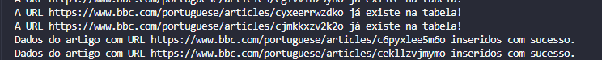
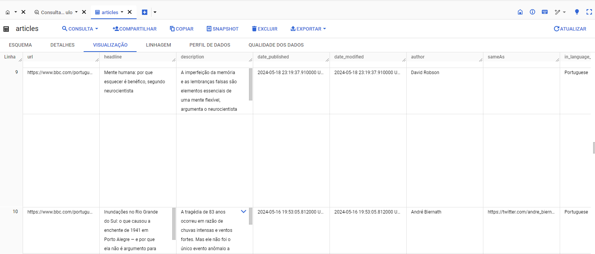
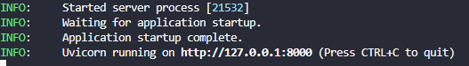
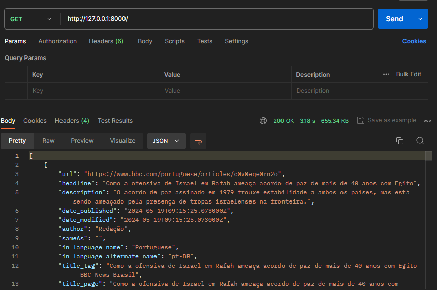
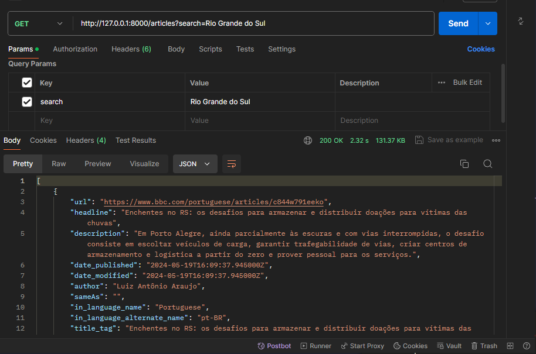
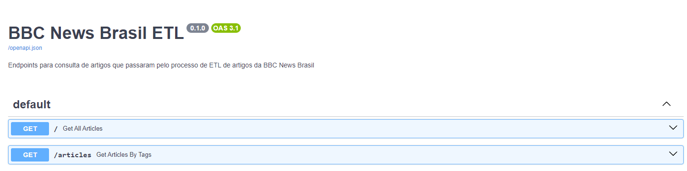

# BBC News Scraping

Repositório referente ao web scraping do BBC News Brasil


## Instalação

1. Baixando o repositório

```bash
  git clone https://github.com/IgorPoti/bbc_scrap.git
```

2. Criando o ambiente virtual
```bash
  python -m venv venv
```

3. Instalando bibliotecas do projeto
```bash
  pip install -r requirements.txt
```

## Pré-requisitos

- Python na sua última versão instalada na máquina
- Conta no _Google Cloud Platform_
- Ter uma chave de conta de serviço
 _Para criar uma conta basta acessar o link_: https://cloud.google.com

## Tecnologias utilizadas

- Python
- Requests
- Beautiful Soup
- FastAPI
- Google Cloud Plataform (GCP)

## Demonstração da ETL

_Para começar a extração, é importante que tenha colocado o caminho correto da sua chave de conta de serviço na variável de ambiente, nomeando a variável como GOOGLE_ACESS._

Após todas as configurações iniciais, digite o seguinte comando para iniciar a raspagem:

```bash
   cd .\bbc_news\
```

```bash
   python task_bbc
```

Com a extração iniciada, deverá visualizar as seguintes mensagens no seu terminal:
1. __Listagem de artigos__
_Trará as listagens de artigos que passarão pelo processo de ETL_


 2. __Extração/Tratamento__

 _Nesse processo ele já trará os dados úteis do artigo como texto do artigo e imagens referentes a ele, removendo as tags html desnecessárias_



3. __Carga para o GCP__
_Nessa etapa já ocorrerá a validação se o artigo existe ou não, fazendo as tratativas necessárias para a carga_



Após todo o processo, deverá receber a mensagem de _Extração e envio de dados concluídos!_

No BigQuery (GCP) deverá visualizar os dados já inseridos na tabela articles



## Demonstração do uso da API

Para utilizar a API e consultar os dados no BigQuery, basta digitar o seguinte comando no terminal:

```bash
   uvicorn main:app --reload
```


Após a inicialização, deverá acessar os seguintes endpoints:

"http://127.0.0.1:8000/"

__Listando todos os artigos (max 100)__



__Listando artigos por palavra chave da noticia (list_tag)__

 "http://127.0.0.1:8000/articles?search=Rio Grande do Sul"




É fornecido a documentação da API acessando os endpoints /docs ou /redoc com o  OpenAPI


